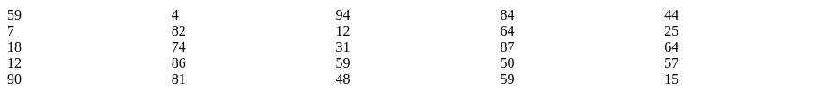

# Installing Leyden

Leyden is divided into several npm packages; the core functionality is separated from the rendering layer. These walkthroughs assume that you'd like to use React to render Leyden, and that you're installing Leyden within a [TypeScript][typescript] application with [React][react] installed and set up.

## Package Installation

Install Leyden, its React renderer, and its peer dependencies ([Slate][slate]).

```text
npm install leyden leyden-react slate slate-react
```

## Editor Setup

In the file of the component where you'd like to mount your Leyden table, pull in several imports from the packages you just installed.

```tsx
// Augment a Slate editor with Leyden's core functionality
import { withLeyden } from 'leyden';

// Augment a Slate editor with Leyden's React rendering layer 
import { withReact } from 'leyden-react';

// Slate (and therefore Leyden) editors are memoized to prevent re-definition
import React, { FC, useMemo } from 'react';

// Create the bare-bones Slate editor
import { createEditor } from 'slate';
```

Use those imports to define a Leyden editor within your component.

```tsx
export const SomeComponent: FC = () => {
    const editor = useMemo(() => (
        withLeyden({
            editor: withReact(
                createEditor()
            ),
        })
    ), []);

    // ...
};
```

## Data Definition

Define a new function which generates a 5x5 table of dummy data to display in our editor. Then, use it to set the initial state of our table.

```tsx
import { Cell, Table } from 'leyden';
import { useState } from 'react';

// ...

const generateTable = (): Table => {
    return Table.new(5, 5, Array.from(
        { length: 25 },
        () => Cell.newDefault(Math.floor(Math.random()*100))
    ));
};

// ...

export const SomeComponent: FC = () => {
    const [value, setValue] = useState<[Table]>([generateTable()]);

    // ...
};
```

## Table Rendering

Render the `Editable` table component within the `Leyden` container.

```tsx
import { Editable, Leyden } from 'leyden-react';

// ...

export const SomeComponent: FC = () => {
    // ...
    return (
        <Leyden
            editor={editor}
            value={value}
            onChange={setValue}
        >
            <Editable />
        </Leyden>
    );
};
```

## Conclusion

Your component should render a 5x5 data table; try clicking into the cells and editing the numbers.



We've rendered a Leyden table, though not a very useful one. We'll put on all the bells and whistles as you progress through these walkthroughs.

## Source Code

Here's the complete source code of our demo component:

```tsx
import { Cell, Table, withLeyden } from 'leyden';
import { Editable, Leyden, withReact } from 'leyden-react';
import React, { FC, useMemo, useState } from 'react';
import { createEditor } from 'slate';

const generateTable = (): Table => {
    return Table.new(5, 5, Array.from(
        { length: 25 },
        () => Cell.newDefault(Math.floor(Math.random()*100))
    ));
};

export const SomeComponent: FC = () => {
    const editor = useMemo(() => (
        withLeyden({
            editor: withReact(
                createEditor()
            ),
        })
    ), []);

    const [value, setValue] = useState<[Table]>([generateTable()]);

    return (
        <Leyden
            editor={editor}
            value={value}
            onChange={setValue}
        >
            <Editable />
        </Leyden>
    );
};
```

[react]: https://reactjs.org/
[slate]: https://github.com/ianstormtaylor/slate
[typescript]: https://www.typescriptlang.org/
